<div align="center">




<br />


</div>


```txt
┌─ MOHIT NAIDU / AI SYSTEMS LAB ───────────────────────────────────────────────┐
│ Role       : Computer Engineering student building applied AI systems         │
│ Focus      : GenAI • RAG • Computer Vision • Reinforcement Learning • DSA     │
│ Build Rule : Learn the fundamentals → break things → debug → rebuild better   │
│ Current    : Portfolio-grade ML projects, cleaner code, stronger systems      │
└───────────────────────────────────────────────────────────────────────────────┘
```

## PROJECTS

<table>
<tr>
<td width="50%">

</td>
<td width="50%">

</td>
</tr>
<tr>
<td width="50%">

</td>
<td width="50%">

</td>
</tr>
<tr>
<td width="50%">

</td>
<td width="50%">

</td>
</tr>
</table>

> Replace the card images with links later by wrapping each `` in an `<a href="YOUR_REPO_LINK">...</a>` tag.


## PROJECT LOGS

<details open>
<summary><b>OPEN MODULE: DataPilot AI</b></summary>

```txt
TYPE      : GenAI data analyst / CSV intelligence workspace
STACK     : FastAPI • React • TypeScript • pandas • NumPy • SciPy • sklearn • OpenAI
SYSTEMS   : schema profiling, data-quality checks, adaptive dashboards, analyst chat
OUTPUT    : exportable analysis artifacts, prediction studio, AI-powered interpretation
RULE      : LLM plans and explains through safe backend tools instead of random code execution
```

DataPilot AI turns raw CSV files into an analytics workspace with profiling, dashboards, grounded chat, prediction workflows, and exportable analysis.

</details>

<details>
<summary><b>OPEN MODULE: VidContext RAG</b></summary>

```txt
TYPE      : Full-stack retrieval-augmented generation app
STACK     : Next.js • FastAPI • ChromaDB • embeddings • transcript chunking
SYSTEMS   : timestamp chunks, retrieval context, grounded answers, source inspection
OUTPUT    : ask questions over YouTube videos with timestamp-backed citations
```

VidContext RAG lets users index video transcripts and ask questions with retrieved context and source timestamps.

</details>

<details>
<summary><b>OPEN MODULE: SiteGuard AI</b></summary>

```txt
TYPE      : Computer vision safety inspection system
STACK     : Ultralytics YOLO • FastAPI • React/Vite • detection reports
SYSTEMS   : worker detection, PPE association, helmet/vest compliance, output images
OUTPUT    : construction-site safety reports from uploaded images
```

SiteGuard AI detects workers, hardhats, safety vests, and missing-PPE violations, then generates compliance reports.

</details>

<details>
<summary><b>OPEN MODULE: DeviceLens</b></summary>

```txt
TYPE      : Agentic phone-condition inspection app
STACK     : Next.js • FastAPI • image validation • detection grounding • GPT explanations
SYSTEMS   : visible damage checks, deterministic condition scoring, local policy rubrics
OUTPUT    : user-friendly phone inspection reports
```

DeviceLens analyzes phone images for damage and condition signals, then explains the final inspection report clearly.

</details>

<details>
<summary><b>OPEN MODULE: HireLens</b></summary>

```txt
TYPE      : Resume-to-job matching and roadmap system
STACK     : React/Vite • FastAPI • PyMuPDF • OpenAI structured outputs • rule-based scoring
SYSTEMS   : multi-JD comparison, ATS checks, evidence maps, skill gaps, bullet rewrites
OUTPUT    : fit badges, roadmap suggestions, resume improvement feedback
```

HireLens compares one resume against multiple job descriptions and turns the result into evidence-backed feedback and roadmaps.

</details>

<details>
<summary><b>OPEN MODULE: Game AI Lab</b></summary>

```txt
TYPE      : Reinforcement learning and game-agent experiments
STACK     : PyTorch • TensorFlow/Keras • Gymnasium • Pygame • MCTS • PPO • DQN
SYSTEMS   : legal-action masking, self-play, replay buffers, checkpoints, evaluation tools
OUTPUT    : agents for 2048, Barricade, Block Blast, Bluff, UNO, Snake, Connect 4
```

A collection of game-AI experiments focused on training loops, measurable improvement, search, policy learning, and evaluation.

</details>


## TECH LOADOUT

<div align="center">


</div>

```txt
PRIMARY      : Python, ML/DL, backend APIs, model training, data pipelines
AI SYSTEMS   : RAG, embeddings, computer vision, GenAI tools, RL/game agents
FRONTEND     : React, Next.js, Vite, Tailwind, dashboard-style UIs
BACKEND      : FastAPI, Flask, local-first APIs, JSON/SQLite/vector-store workflows
HABIT        : Build locally first, make it work, then make it cleaner
```

## CURRENT QUESTS

```txt
[ACTIVE] Strengthen ML and deep-learning fundamentals
[ACTIVE] Build portfolio-grade AI projects with real workflows
[ACTIVE] Improve DSA and problem-solving with Python
[ACTIVE] Turn rough prototypes into clean, explainable systems
```


## SIGNAL FEED

<div align="center">


<br /><br />


</div>


<div align="center">

```txt
Learning slow. Building steady. Aiming high.
```

</div>
