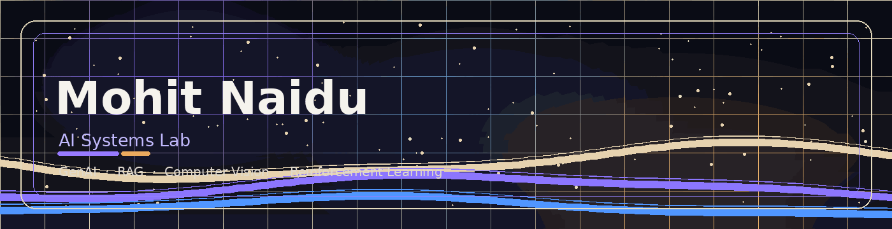
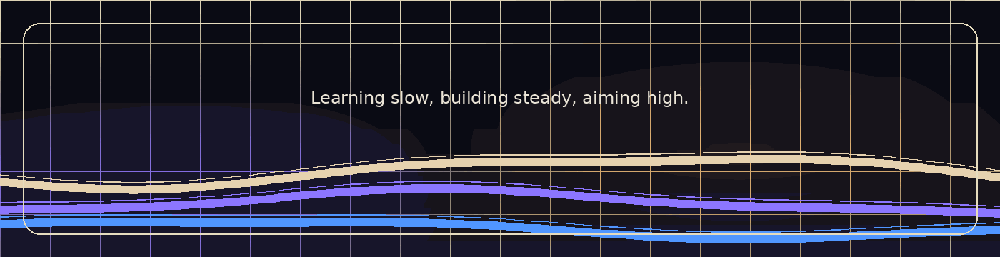

<!--
  GitHub Profile README — Calm SaaS / Dark Portfolio Theme
  Replace ./assets/header.gif and ./assets/footer.gif with your own animated wave GIFs.
  Keep the files inside your profile repo: xMN-28/xMN-28/assets/
-->

<p align="center">
  
</p>

<h1 align="center">Mohit Naidu</h1>

<p align="center">
  <b>Computer Engineering Student · AI/ML Builder</b>
  <br />
  GenAI · RAG · Computer Vision · Reinforcement Learning · DSA
</p>

<p align="center">
  <i>Building useful AI systems, not just demos.</i>
</p>

<p align="center">
  <a href="https://github.com/xMN-28?tab=repositories"></a>
  
  
</p>

<br />

## `$ whoami`

I’m a Computer Engineering student from India building applied AI/ML projects across **GenAI**, **RAG**, **computer vision**, and **reinforcement learning**.

I like projects where the AI has a clear job: an analyst, retriever, inspector, evaluator, or game agent. My focus is on understanding the fundamentals, building working systems, and improving them until they feel portfolio-grade.

```txt
Role       : Computer Engineering Student
Focus      : AI/ML systems, GenAI tools, RAG apps, CV pipelines, RL agents
Build Rule : Learn the concept -> build the system -> break it -> rebuild cleaner
Current    : Stronger fundamentals, better projects, cleaner engineering
```

---

## `$ ls featured-projects/`

| Project | Focus | What it does |
|---|---|---|
| **DataPilot AI** | GenAI + Data Analytics | Turns CSV files into schema profiles, dashboards, analyst chat, insights, exports, and prediction workflows. |
| **VidContext RAG** | RAG System | Lets users ask questions over YouTube transcripts with timestamp-grounded context and source inspection. |
| **SiteGuard AI** | Computer Vision | Detects construction-site PPE compliance, associates workers with gear, and generates safety reports. |
| **DeviceLens** | Agentic Vision | Inspects phone condition from images using deterministic scoring, visual grounding, and optional GPT explanations. |
| **HireLens** | GenAI + Resume Analysis | Compares resumes against multiple job descriptions and returns fit scores, evidence maps, rewrites, and roadmaps. |
| **Game AI Lab** | RL + Search | Reinforcement-learning and search-based agents for 2048, Bluff, UNO, Barricade, Snake, Connect 4, and walking AI. |

<details>
<summary><b>Open project notes</b></summary>

### DataPilot AI
An autonomous CSV analytics workspace with data-quality checks, adaptive dashboards, grounded analyst chat, exportable artifacts, and a prediction studio.

### VidContext RAG
A full-stack YouTube RAG app that chunks transcripts with timestamps, stores embeddings, retrieves relevant context, and answers with grounded citations.

### SiteGuard AI
A construction-site safety system built around YOLO detection, PPE association, helmet/vest compliance, output images, and inspection reports.

### DeviceLens
A phone-condition inspection app that validates device images, grounds visible damage, applies scoring rules, and explains condition reports.

### HireLens
A resume-to-job matching app that extracts resume text, parses job descriptions, scores fit, maps evidence, and creates learning/project roadmaps.

### Game AI Lab
A collection of RL/search experiments covering DQN, PPO, MCTS, legal-action masking, self-play, replay buffers, evaluation tools, and playable interfaces.

</details>

---

## `$ cat tech_stack.json`

```json
{
  "languages": ["Python", "JavaScript", "TypeScript", "HTML", "CSS"],
  "ai_ml": ["PyTorch", "TensorFlow", "scikit-learn", "OpenCV", "Ultralytics YOLO"],
  "genai_rag": ["OpenAI API", "Embeddings", "ChromaDB", "RAG pipelines", "Structured outputs"],
  "backend": ["FastAPI", "Flask", "Node.js", "Express"],
  "frontend": ["React", "Next.js", "Vite", "Tailwind CSS"],
  "data": ["pandas", "NumPy", "SciPy", "SQLite", "JSON stores"],
  "workflow": ["Git", "GitHub", "local-first builds", "API-driven apps"]
}
```

---

## `$ tree interests/`

```txt
AI/ML
├── GenAI tools that solve real workflow problems
├── RAG systems with grounded retrieval and citations
├── Computer vision apps with practical inspection use cases
├── Reinforcement-learning agents for games and simulations
└── Clean Python systems with strong logic and measurable outputs
```

---

## `$ cat current_status.md`

- Strengthening ML and deep-learning fundamentals
- Practicing DSA with Python
- Building portfolio-grade AI/ML systems
- Improving project presentation, READMEs, and demos
- Learning by building, breaking, debugging, and rebuilding

---

## `$ github --stats`

<p align="center">
  
  
</p>

<p align="center">
  
</p>

---

<p align="center">
  
</p>

<p align="center">
  <i>Learning slow, building steady, aiming high.</i>
</p>
